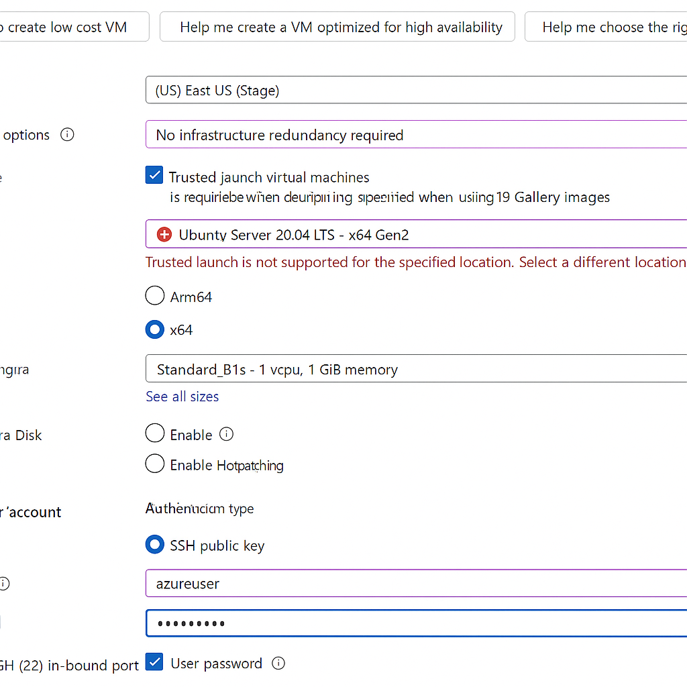
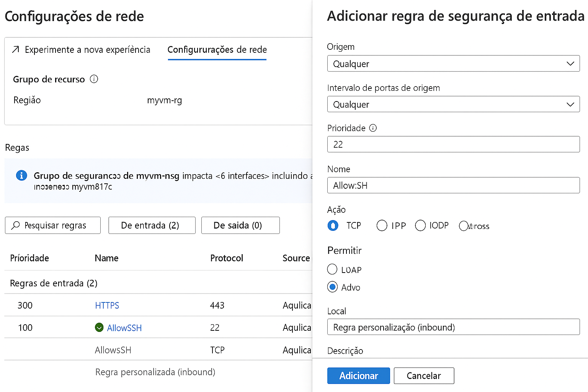

# 💻 Guia Prático: Criação e Configuração de Máquina Virtual no Microsoft Azure

Este repositório contém **resumos**, **anotações** e **dicas práticas** sobre o uso da plataforma **Microsoft Azure**, com foco na criação e gerenciamento de **máquinas virtuais (VMs)**. Serve como material de apoio para estudos, testes e futuras implementações em ambientes de nuvem.

---

## ✨ Objetivos

- Praticar o processo completo de criação de uma VM no Azure.
- Documentar de forma clara os passos e decisões técnicas.
- Servir de base para estudos e reuso de boas práticas em projetos futuros.

---

## 📦 Pré-requisitos

- Conta na Microsoft (preferencialmente uma conta gratuita ou de estudante com créditos).
- Cartão de crédito válido (para ativação da conta gratuita).
- Acesso ao portal [https://portal.azure.com](https://portal.azure.com).
- (Opcional) Git e GitHub configurados localmente.

---

## 🚀 Etapas para Criação de uma Máquina Virtual

### 1. Criar Conta no Azure

Acesse o portal do Azure em [https://azure.microsoft.com/pt-br/free](https://azure.microsoft.com/pt-br/free) e crie sua conta gratuita.

> **Dica**: o plano gratuito oferece US$ 200 em crédito por 30 dias e serviços gratuitos por 12 meses.

### 2. Criar uma Máquina Virtual (VM)

1. No menu lateral do portal, clique em **"Criar um recurso" > "Máquina Virtual"**.
2. Configure os parâmetros:



- **Grupo de Recursos**: criar novo ou usar existente.
- **Nome da VM**: ex. `vm-azure-dev`.
- **Região**: ex. `East US`.
- **Imagem**: `Ubuntu Server 20.04 LTS`.
- **Tamanho**: `B1s` (incluso no nível gratuito).
- **Autenticação**: escolha **senha** ou **chave SSH**.
- **Portas abertas**: marque `SSH (22)`.

3. Revise e clique em **Criar**.

### 3. Acessar a VM via SSH

Após a VM estar "em execução", copie o IP público e conecte via terminal:

```bash
ssh azureuser@<ip-público>
```

---

## ⚙️ Configurações úteis

### ✅ Adicionar regra de segurança SSH manualmente

1. Vá em **"Rede" > "Grupo de segurança de rede (NSG)"**.
2. Crie nova regra de entrada:



- Porta de destino: `22`
- Protocolo: `TCP`
- Ação: `Permitir`

### ✅ Configurar mensagem de boas-vindas

Dentro da VM, execute:

```bash
sudo nano /etc/motd
```

Digite sua mensagem de boas-vindas, por exemplo:

```
Bem-vinda, Luciane! Esta é sua VM no Azure ☁️🚀
```

---

## 🧠 Dicas e Boas Práticas

- Verifique sempre as **portas abertas no NSG**.
- Use regiões comuns como `East US` ou `West Europe`.
- A **VM B1s** está inclusa no nível gratuito por até 750h/mês.
- Ative **monitoramento e logs** para entender o uso e custo.
- Utilize o **Azure CLI** para automações.

---

## 📚 Referências

- [Documentação oficial do Azure](https://learn.microsoft.com/pt-br/azure/)
- [Azure para Estudantes](https://azure.microsoft.com/pt-br/free/students/)
- [Guia CLI do Azure](https://learn.microsoft.com/pt-br/cli/azure/install-azure-cli)

---

## ✍️ Autora

- **Luciane Boanova**
- Repositório criado para prática com Azure Cloud.
